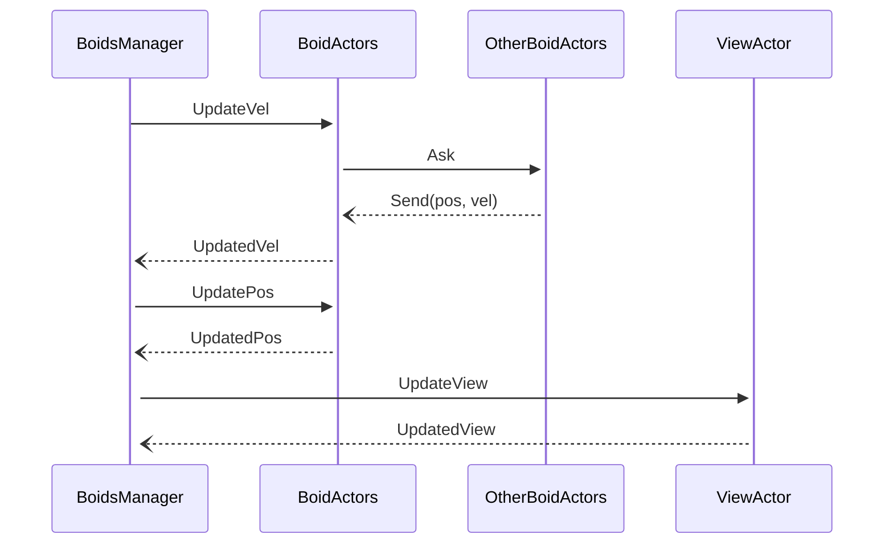
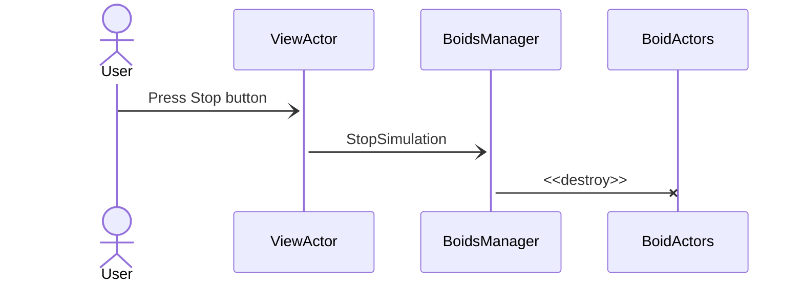
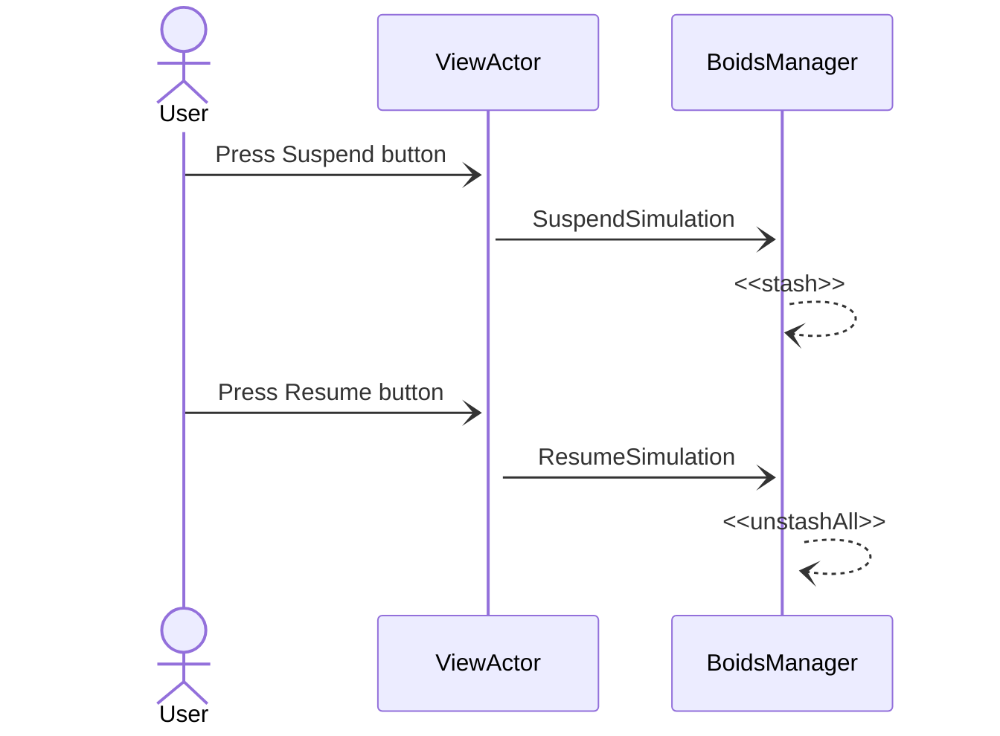

# Actors

## Boids Simulation

```mermaid
sequenceDiagram
    BoidsManager->>+BoidActors: UpdateVel
    BoidActors->>+OtherBoidActors: Ask
    OtherBoidActors--)+BoidActors: Send(pos, vel)
    BoidActors--)+BoidsManager: UpdatedVel
    BoidsManager->>+BoidActors: UpdatePos
    BoidActors--)+BoidsManager: UpdatedPos
    BoidsManager->>+ViewActor: UpdateView
    ViewActor--)+BoidsManager: UpdatedView
```

## Stop

```mermaid
sequenceDiagram
    actor User
    User-)+ViewActor: Press Stop button
    ViewActor-)+BoidsManager: StopSimulation
    BoidsManager-xBoidActors: <<destroy>>
```

## Suspend/Resume

```mermaid
sequenceDiagram
    actor User
    User-)+ViewActor: Press Suspend button
    ViewActor-)+BoidsManager: SuspendSimulation
    BoidsManager--)+BoidsManager: <<stash>>
    User-)+ViewActor: Press Resume button
    ViewActor-)+BoidsManager: ResumeSimulation
    BoidsManager--)+BoidsManager: <<unstashAll>>
```