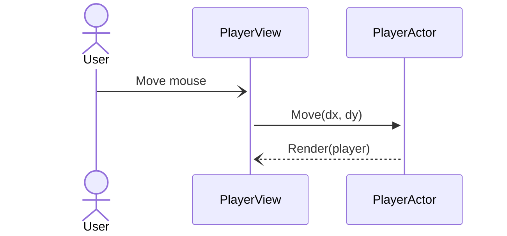
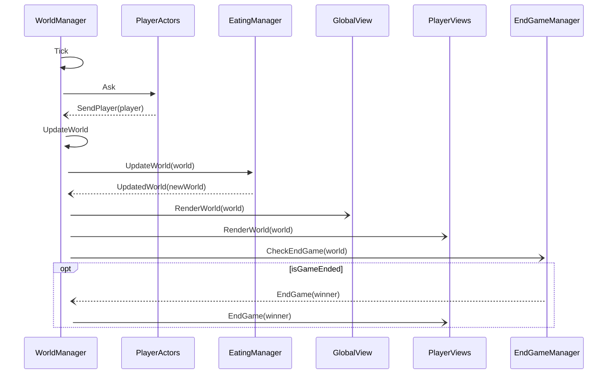

# Actors

## Interazioni in locale tra PlayerActor e PlayerView

```mermaid
sequenceDiagram
    actor User
    User-)+PlayerView: Move mouse
    PlayerView->>+PlayerActor: Move(dx, dy)
    PlayerActor--)+PlayerView: Render(player)
```

## WorldManager

```mermaid
sequenceDiagram
    WorldManager->>+WorldManager: Tick
    WorldManager->>+PlayerActors: Ask
    PlayerActors--)+WorldManager: SendPlayer(player)
    WorldManager->>+WorldManager: UpdateWorld
    WorldManager->>+EatingManager: UpdateWorld(world)
    EatingManager--)+WorldManager: UpdatedWorld(newWorld)
    WorldManager-)+GlobalView: RenderWorld(world)
    WorldManager-)+PlayerViews: RenderWorld(world)
    WorldManager-)+EndGameManager: CheckEndGame(world)
    opt isGameEnded
      EndGameManager--)+WorldManager: EndGame(winner)
      WorldManager -)+PlayerViews: EndGame(winner)
    end
```
